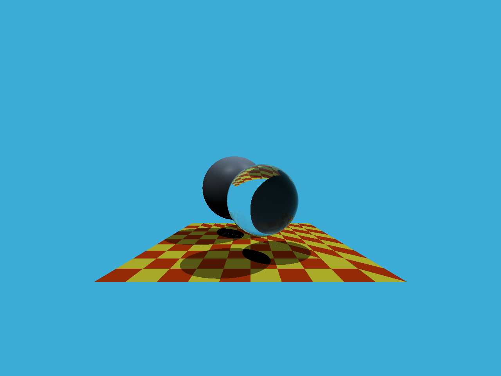
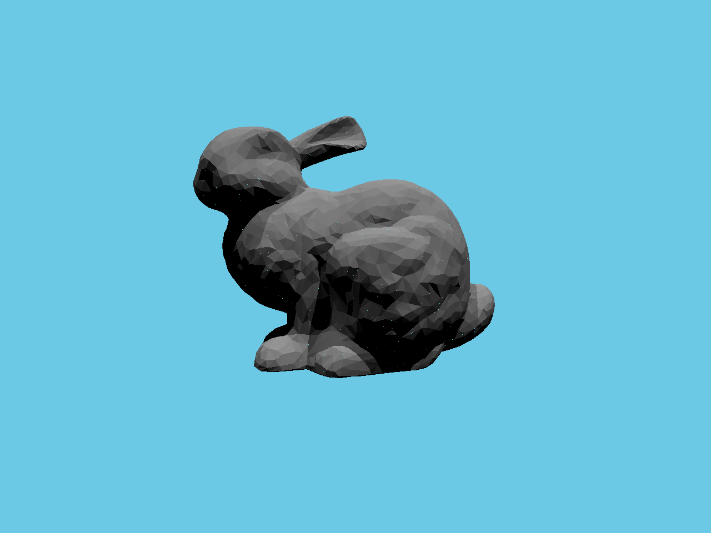
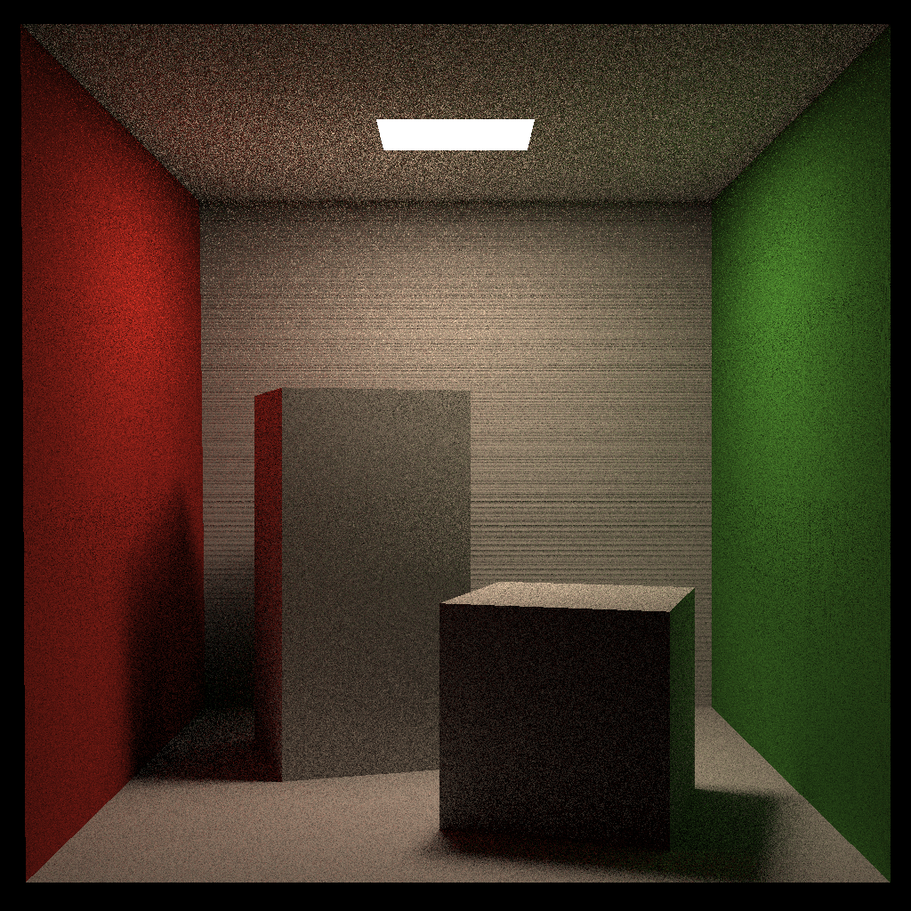

# RayTracerHowTo
A handwritten ray tracer with clean and well-annotated C++ implementation for systematic learning toward Computer Graphics.

## Supported Features
* Ray intersection with rectangle by Moller-Trumbore algorithm.
* Ray intersection with bounding volumes with Axis-Aligned Bounding Box (AABB).
* Acceleration with Bounding Volume Hierarchy (BVH) and Surface Area Heuristic (SAH).
* Acceleration with multiple threading.
* Whitted-Style Ray Tracing.
* Path Tracing.

## Get Started
* From source
```bash
# more build details see `Development`
git clone https://github.com/dadadadawjb/RayTracerHowTo.git
cd RayTracerHowTo
mkdir build
cd build
cmake ..
make

./RayTracerHowTo
```

* From release binary
```bash
# download from https://github.com/dadadadawjb/RayTracerHowTo/releases as `RayTracerHowTo`

./RayTracerHowTo
```

## Results
* Demo Whitted-Style Ray Tracing



* Bunny Whitted-Style Ray Tracing



* Cornell Box Path Tracing




## Development
At present, the use of `RayTracerHowTo` is somehow awkward.
The configurations are all set in `global.hpp`.
Specifically, `DEMO` determines whether to ray trace demo triangles and spheres or OBJ models, 
`BUNNY` determines whether to ray trace bunny OBJ model or not, 
`CORNELLBOX` determines whether to ray trace cornell box or not, 
`PATH` determines whether to use path tracing or just Whitted-style ray tracing, 
`ACCELERATION` determines whether to use BVH acceleration or not, 
`MULTITHREADING` determines whether to use multiple threading to accelerate ray tracing or not, 
`SAH_ACC` determines whether to use SAH acceleration or not.
Further, not all combinations of them are allowed, see `global.hpp` for more detailed explanation.
Every time you changed, you should compile it again.

Another thing needed to notice is that, 
you need to set your path to `Eigen` inside `CMakeLists.txt`.
Also for easier experience, I do not ignore `.vscode` which provides C/C++ intellisense and build configuration, 
you need to set your path to `Eigen` and `OpenCV`.

## Note
The skeleton is taken from [GAMES101](https://sites.cs.ucsb.edu/~lingqi/teaching/games101.html) by [Lingqi Yan](https://sites.cs.ucsb.edu/~lingqi/).
