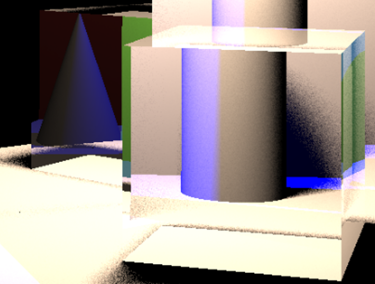

# RayTracerHowTo
A handwritten ray tracer with clean and well-annotated C++ implementation for systematic learning toward Computer Graphics.

## Supported Features
* 5 geometries: Moller-Trumbore algorithm for `Triangle` and `MeshTriangle`, Parametric Equation for `Sphere`, `Cylinder` and `Cone`.
* 4 materials: Diffuse, Reflection, Refraction and Fresnel Effect.
* 2 lights: Point light and Surface light, both available in both Whitted-style Ray Tracing and Path Tracing.
* Pinhole Camera Model.
* Acceleration with Bounding Volume Hierarchy (BVH) and Surface Area Heuristic (SAH) and Axis-Aligned Bounding Box (AABB).
* Acceleration with multiple threading.
* Whitted-Style Ray Tracing.
* Path Tracing.
* Gamma Correction.

## Get Started
* From source
```bash
# more build details see `Development`
git clone https://github.com/dadadadawjb/RayTracerHowTo.git
cd RayTracerHowTo
mkdir build
cd build
cmake ..
make

./RayTracerHowTo
```

* From release binary
```bash
# download from https://github.com/dadadadawjb/RayTracerHowTo/releases as `RayTracerHowTo`

./RayTracerHowTo
```

## Results
* Whitted-Style Ray Tracing, around 5s


* Path Tracing, 1024 SPP around 50min, 32 SPP around 70s


* Whitted-Style Ray Tracing step-by-step


* Path Tracing step-by-step


* Global illumination effections





## Development
At present, the use of `RayTracerHowTo` is somehow awkward.
The configurations are all set in `global.hpp`.
Every time you changed, you should compile it again.

Another thing needed to notice is that, 
you need to make sure `Eigen` and `OpenCV` are installed, 
and set your path to `Eigen` inside `CMakeLists.txt`.
Also for easier experience, I do not ignore `.vscode` which provides C/C++ intellisense and build configuration, 
you need to set your path to `Eigen` and `OpenCV`.

## Note
The skeleton is taken from [GAMES101](https://sites.cs.ucsb.edu/~lingqi/teaching/games101.html) by [Lingqi Yan](https://sites.cs.ucsb.edu/~lingqi/).
